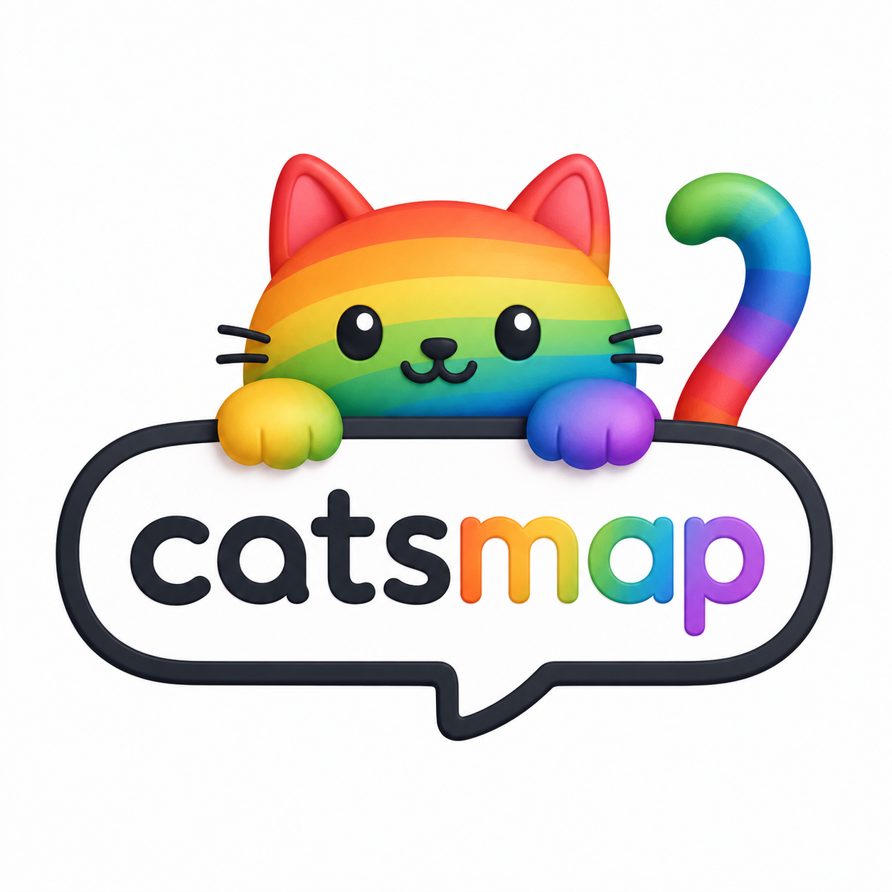

# CatsMap
<p align="center">
  
</p>

    ## Cute, private LAN chat — like Discord, but yours.

CatsMap is a self-hosted LAN chat server. One PC per WiFi network acts as the host ("Map"). Everyone on the network connects via browser. Share codes let two networks bridge securely.
Structure

## CatsMap/
├── server/          # Rust (Axum) backend — the Map server
├── web/             # React + TypeScript frontend — the glassy UI
├── installer/       # Electron GUI installer wizard
└── mobile/          # Expo Go scaffold (future)

### Quick Start

    Run the installer or cd server && cargo run
    Open http://localhost:3000 on any device on the same WiFi
    Pick a cat name 🐱 and start chatting

## Share Codes

Network admins can generate a Share Code in Settings. When two admins both enter each other's codes, their networks bridge and users can chat cross-network.

## Marketing Website

A separate React + JSX marketing website lives in `website/`. It highlights CatsMap features, includes screenshot-style product mockups, explains how to use CatsMap, and documents setup steps for GitHub Pages deployment.

### Run locally

```bash
cd website
npm install
npm run dev
```

### Build for production

```bash
cd website
npm run build
```

### Deploy with GitHub Pages

1. Update `website/package.json` and replace `YOUR_GITHUB_USERNAME` in the `homepage` value.
2. Push the repository to GitHub.
3. In the GitHub repository settings, open **Pages** and set the source to **GitHub Actions**.
4. Push to `main` or run the **Deploy CatsMap website to GitHub Pages** workflow manually.
